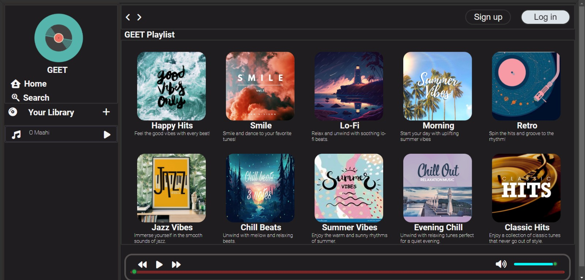

# GEET : A Sophisticated Music Experience

## Description

GEET is a meticulously crafted musical website, built with a deep passion for both music and technology. Leveraging the simplicity and power of HTML, CSS, and JavaScript, GEET offers users an immersive experience through a sleek and intuitive interface.

## Images

## Video Preview
[Watch the Interface Video](Images/GEET_VID_Clip.mp4)

## Usage

1. **Clone the GEET Repository**: Start by cloning the GEET repository to your local machine. This will give you access to all the code and files necessary to run the website.
2. **Add Your Songs**: Navigate to the Sons_tp folder within the cloned repository. Add the songs of your choice to this folder. These songs will be used by the website as your personal playlist.
3. **Run Locally**: Open the index.html file in your favorite web browser to start GEET on your local host. Enjoy the music from playlists made up of the songs you've added, all without any ads or interruptions.

4. **Customize**: Feel free to modify the HTML, CSS, or JavaScript files to further personalize your music player. You can add more songs, change the design, or even enhance the functionality as you see fit.

 

Enjoy a personalized, ad-free music experience with GEET, directly from your local host!

## Key Features

**Playback Controls**: Enjoy your favorite tracks with essential playback controls, including play, pause, forward, and backward. These features ensure that you have complete command over your music, enhancing the listening experience.

**Dynamic Albums**: GEET's unique approach to album management allows users to explore a dynamic collection of music albums. Each album is beautifully presented, making it easy for users to navigate through different tracks and genres.

**Local Folder as API**: One of the standout features of GEET is its innovative use of a local folder as an API link. This unconventional approach allows the website to pull music directly from a designated folder, creating a seamless and personalized music library. Although not a real-time API, this method ensures that the music is always available and easily accessible.

**User-Centric Design**: GEET is designed with the user in mind. The interface is clean, responsive, and user-friendly, making it the best music player for those who appreciate both functionality and aesthetics.

## Why GEET Stands Out:

**Personalized Experience**: By using your own music collection, GEET offers a deeply personal and tailored music experience, unlike any other player.

**Attention to Detail**: Every aspect of GEET has been carefully considered, from the fluid transitions between tracks to the smooth handling of album artwork.

**Cutting-Edge Simplicity**: While it may seem simple on the surface, the underlying code is a testament to the power of modern web development techniques. The combination of HTML, CSS, and JavaScript creates a robust platform that is both lightweight and efficient.

## Future Enhancements:

Expanding the Music Library: While only a few songs are currently uploaded, there's a clear plan to expand the collection, providing a wider range of genres and tracks to enhance the overall experience.
GEET is more than just a music player; it's a reflection of the creator's dedication to merging technology with the art of music. Whether you're looking to relax with some Lo-Fi beats or get energized with Happy Hits, GEET is your go-to music destination.

 

Feel free to explore the code, customize the player, and make it your own. GEET is a perfect blend of creativity and technical prowess, designed to elevate your music experience.
